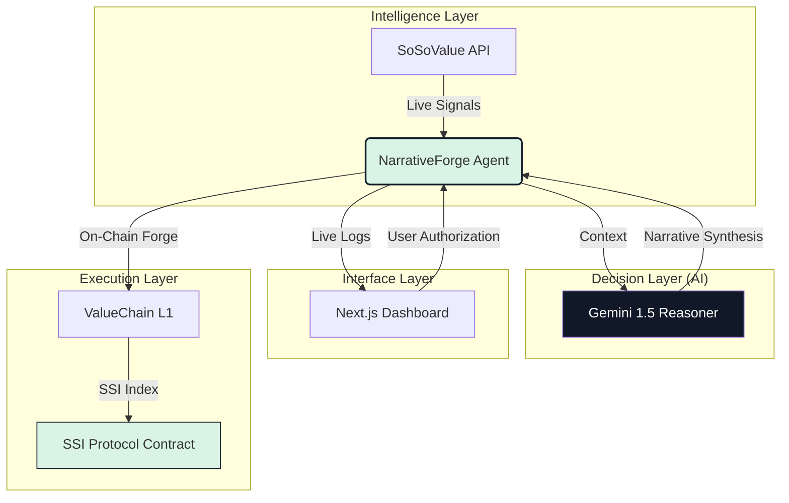

# ⚡ NarrativeForge: Autonomous Index Publisher

NarrativeForge is a state-of-the-art autonomous platform designed to bridge the gap between **Real-time Financial Intelligence** and **On-Chain Execution**. Built for the Next-Gen DeFi ecosystem on **ValueChain**, it empowers users to discover, analyze, and forge thematic indices (SSI) with the power of Agentic AI.

---

## 🏆 **Powered By**
- **SoSoValue Intelligence**: Real-time market news clusters, sector spotlights, and social sentiment data.
- **Gemini 1.5 Flash**: High-speed reasoning engine for narrative synthesis and momentum scoring.
- **ValueChain L1**: High-performance blockchain infrastructure for verifiable on-chain execution.
- **SSI Protocol**: The decentralized standard for Solvency Standardized Indexes.

---


## 🏗️ **Architecture & Workflow**

The system operates as a continuous research-to-execution cycle, synthesizing world-class intelligence with agentic decision-making.



---

## 🚀 **Key Features**

### 🧠 **Autonomous Intelligence Extraction**
Constantly parses thousands of news signals from **SoSoValue** to identify emerging market themes (e.g., "AI Season", "L2 Scaling Wars", "RWA Expansion") before they go viral.

### ⚡ **Agentic Narrative Synthesis**
Utilizes **Gemini 1.5 Flash** to perform deep reasoning on market clusters, calculating a **Momentum Score** and generating optimal token compositions for the detected narratives.

### ⛓️ **Verifiable On-Chain Forging**
Publishes index compositions directly to the **SSI Protocol** on the **ValueChain Testnet**. Every index is verifiable, transparent, and built for high-throughput execution.

### 🎨 **Premium Cinematic Interface**
A high-end, responsive dashboard built with Next.js and Framer Motion, featuring real-time terminal logs, interactive glow shaders, and scroll-driven parallax animations.

---

## 🛠️ **Tech Stack**

- **Frontend**: Next.js 15+, Tailwind CSS, Framer Motion, Lucide React.
- **Backend**: Python FastAPI, Uvicorn, Pydantic.
- **AI Engine**: Google Gemini 1.5 Flash.
- **Data Source**: SoSoValue API.
- **Blockchain**: Web3.py, ValueChain Testnet, SSI Protocol.
- **Documentation**: Docusaurus.

---

## 📦 **Structure & Installation**

The project is organized into three primary modules:

```text
Narrative-Forge/
├── frontend/    # Next.js Cinematic Dashboard
├── backend/     # Python FastAPI AI Agent
└── docs/        # Docusaurus Technical Documentation
```

### **1. Backend Setup**
```bash
cd backend
pip install -r requirements.txt
# Configure .env with your GEMINI_API_KEY and SOSO_API_KEY
python main.py
```

### **2. Frontend Setup**
```bash
cd frontend
npm install
npm run dev
```

### **3. Documentation Hub**
```bash
cd docs
npm install
npm run start -- --port 3001
```

---

## 📖 **Resources & Documentation**
- **Deep Dive**: Check out the [Architecture Docs](docs/docs/architecture/engine.md) for engine logic.
- **On-Chain Logic**: View the [Execution Layer](docs/docs/layers/execution.md) details.
- **Whitepaper**: Read our [Technical Whitepaper](backend/whitepaper.md).

---

## 🔒 **License**
Distributed under the MIT License. See `LICENSE` for more information.

---

**Built for the Wave Hacks Buildathon.** ⚡
