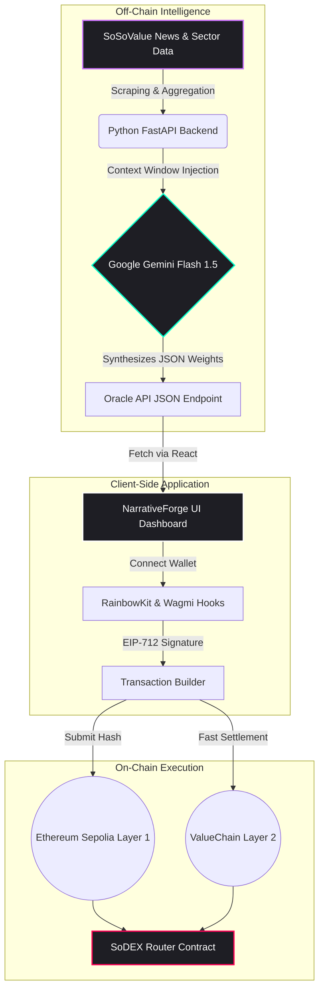
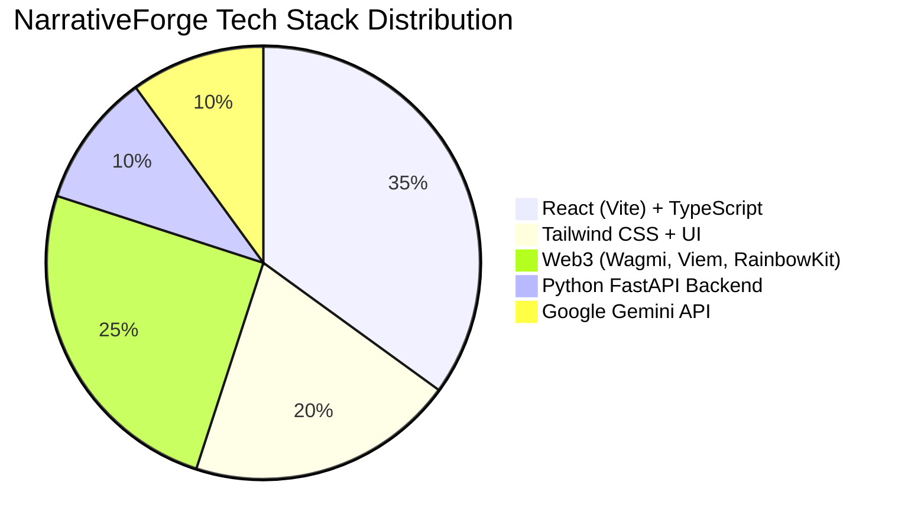

  
  <h1>NarrativeForge</h1>
  
<strong>The First AI-Powered On-Chain Oracle for Decentralized Narrative Trading</strong>

  
<em>Eliminating latency between narrative detection and on-chain execution.</em>

  
  
  
  

## Vision & Motivation: Why I Built This

The cryptocurrency market moves at the speed of light. Retail traders constantly suffer from a massive latency gap between **narrative formation** (news, social sentiment) and **execution**. Institutional players use closed-loop algorithmic bots to parse data and front-run retail, leaving everyday users reacting to stale information.

**I built NarrativeForge to bridge this global access gap.** 

NarrativeForge is a decentralized oracle engine. It continuously scrapes metadata from SoSoValue, pipes it through Google Gemini 1.5 Flash for high-speed sentiment inference, and automatically prepares gas-optimized, EIP-712 structured smart contract transactions to be settled on the SoDEX Router via ValueChain Layer 2. **It brings institutional-grade alpha directly to the Web3 wallets of everyday users.**

---

## Wave 2 Upgrade: Evolution of the Platform

NarrativeForge didn't start like this. We underwent a massive architectural overhaul during **Wave 2** to shift from a centralized Web2 tool to a fully decentralized Web3 powerhouse.

### Previous Architecture (Wave 1)
- **Centralized Data Silos**: We only displayed static charts scraped via APIs.
- **No Execution**: Users had to manually copy signals and go to centralized exchanges (CEXs) to place trades.
- **Generic AI**: Simple prompt outputs that lacked financial precision.
- **Clunky UI**: Standard templates with poor navigation.

### The Wave 2 Upgrade (Current)
- **Decentralized On-Chain Execution**: Integrated **Wagmi/Viem** and **RainbowKit** to allow one-click execution directly via Web3 wallets.
- **SoDEX Router on ValueChain**: Migrated settlement to ValueChain Layer 2 and Ethereum Sepolia to bypass gas fees and utilize the SoDEX Perpetual network.
- **Institutional AI Oracle**: Overhauled the Python FastAPI backend to use **Gemini 2.5 Flash**, returning precise JSON arrays mapped strictly to token weights (up to 10,000 basis points).
- **Premium Dark Mode Interface**: Built a stunning, custom Tailwind UI featuring 3D text effects, HLS video integration, and smooth architectural scrolling.

---

## System Architecture

Here is the visual representation of how the NarrativeForge ecosystem processes data from off-chain sentiment to on-chain settlement:

---

## Technologies & Resources Used

We utilized a modern, high-performance stack to ensure sub-second inference and Visa-level transaction concurrency.

### Detailed Stack Breakdown
1. **Frontend Core**: Vite, React 18, TypeScript, Tailwind CSS, Lucide React, Recharts.
2. **Web3 Integration**: `wagmi`, `viem`, `@rainbow-me/rainbowkit` for WalletConnect and MetaMask integration.
3. **Backend & AI**: Python 3.10+, FastAPI, `google-generativeai` (Gemini 1.5 Flash), deployed on Vercel Serverless.
4. **Data Sources**: SoSoValue APIs and localized crypto indexing scripts.

---

## Smart Contract Details

NarrativeForge interacts with specific testnet layers to ensure scalable execution without massive gas fees during its beta phase.

| Network | Chain ID | Contract Name | Contract Address |
| :--- | :--- | :--- | :--- |
| **Ethereum Sepolia (L1)** | `11155111` | SoDEX Router | `0xCE2979887785d415b407727CDd8f6Ed752AAE335` |
| **Ethereum Sepolia (L1)** | `11155111` | USDT Mock Token | `0x7169D38820dfd117C3FA1f22a697dBA58d90BA06` |
| **ValueChain (L2)** | `138565` | ValueChain Oracle | *Internal System Routing* |

*RPC Endpoint for ValueChain: `https://testnet-rpc.valuechain.dev`*

---

## Acknowledgments

Building NarrativeForge has been an incredible journey. Merging AI inference with decentralized blockchain execution is technically extremely complex, requiring synchronization between non-deterministic LLMs and hyper-deterministic smart contracts. 

Thank you to the communities behind **React**, **Wagmi**, **Gemini**, and **ValueChain** for providing the open-source infrastructure that makes platforms like this possible. 

---

  
<strong>Crafted by Shriyash Soni</strong>

  <a href="https://github.com/shriyashsoni">GitHub</a> • <a href="https://x.com/shriyashsoni">Twitter / X</a>

