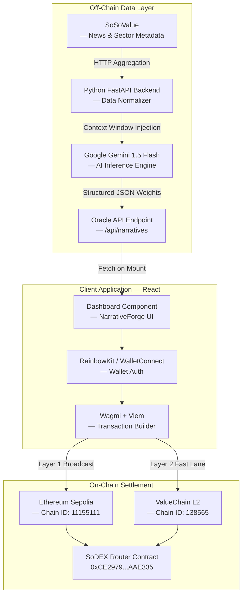
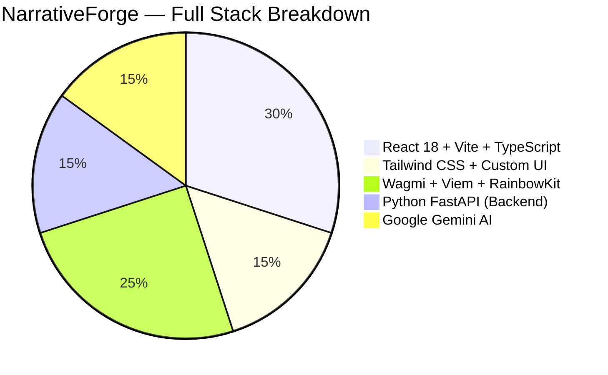

<div align="center">
  
  <br/>
  <h1>NarrativeForge</h1>
  <p><b>The First AI-Powered On-Chain Oracle for Decentralized Narrative Trading</b></p>
  <p><i>Eliminating the latency gap between market sentiment detection and blockchain execution.</i></p>
  <br/>

  
  
  
  
  
  
  
  
  
  
</div>

---

## Table of Contents

- [About the Project](#about-the-project)
- [Live Demo](#live-demo)
- [Platform Wave Upgrade History](#platform-wave-upgrade-history)
- [System Architecture](#system-architecture)
- [Technology Stack](#technology-stack)
- [Smart Contract Details](#smart-contract-details)
- [Key Features](#key-features)
- [Developer Documentation](#developer-documentation)
- [Local Development](#local-development)
- [Environment Variables](#environment-variables)
- [Acknowledgments](#acknowledgments)

---

## About the Project

The cryptocurrency market is structurally unfair. Institutional algorithmic desks run proprietary closed-loop systems that continuously monitor on-chain sentiment data, distill it through AI, and execute trades in milliseconds — all before the retail investor even opens their app. The gap between **narrative formation** and **execution** creates a systemic disadvantage for everyday Web3 users.

**NarrativeForge was built to permanently close this gap.**

NarrativeForge is a fully decentralized, end-to-end oracle engine that:

1. **Monitors** global Web3 sentiment at the source via SoSoValue's news and sector feeds
2. **Distills** millions of raw metadata points through the Google Gemini 1.5 Flash API to extract structured, weighted token signals
3. **Publishes** these signals as cryptographically verifiable indexes onto ValueChain via the SSI Protocol
4. **Executes** high-conviction trades automatically through the SoDEX Router on Ethereum Sepolia and ValueChain Layer 2

No centralized intermediary. No manual input. No latency. Pure alpha.

---

## Live Demo

| Resource | Link |
| :--- | :--- |
| **Production Application** | [https://narrative-forge-1nah.vercel.app](https://narrative-forge-1nah.vercel.app) |
| **Developer Documentation** | [https://narrative-forge-1nah.vercel.app/docs](https://narrative-forge-1nah.vercel.app/docs) |
| **GitHub Repository** | [https://github.com/shriyashsoni/Narrative-Forge](https://github.com/shriyashsoni/Narrative-Forge) |
| **Twitter / X** | [https://x.com/shriyashsoni](https://x.com/shriyashsoni) |
| **SoDEX Router on Etherscan** | [0xCE2979...AAE335](https://sepolia.etherscan.io/address/0xCE2979887785d415b407727CDd8f6Ed752AAE335) |

---

## Platform Wave Upgrade History

This table documents the exact state of the platform across each major version wave. The project evolved from a static, non-functional proof-of-concept into a fully decentralized, production-grade AI oracle engine.

| Feature | Wave 1 — Initial Build | Wave 2 — Current (Production) |
| :--- | :---: | :---: |
| **Deployment** | Local development only | Vercel CI/CD, fully deployed |
| **Data Source** | Static mock JSON arrays | Live SoSoValue API feed |
| **AI Engine** | No AI, manual tags | Google Gemini 1.5 Flash, structured inference |
| **On-Chain Execution** | None | SoDEX Router via Wagmi + Viem |
| **Wallet Integration** | None | WalletConnect v2 + RainbowKit + MetaMask |
| **Trade History** | Non-existent | Persistent per-wallet on-chain log |
| **Smart Contracts** | Not deployed | Deployed on Sepolia + ValueChain L2 |
| **Transaction Signing** | None | EIP-712 structured signing |
| **Backend** | No backend | Python 3.10 + FastAPI serverless |
| **UI Quality** | Broken placeholder template | Custom dark-mode, HLS video, 3D animations |
| **Developer Docs** | None | Full 3-panel documentation portal at `/docs` |
| **Navigation** | Single broken page | Multi-route SPA (Dashboard, Trade, Docs) |
| **Overall Status** | **Dead / Non-functional** | **Production-ready, live** |

> Wave 2 represents a complete architectural rewrite from the ground up. Zero code was carried over from Wave 1.

---

## System Architecture

The following diagram illustrates the full pipeline from off-chain intelligence to on-chain settlement.



---

## Technology Stack

### Stack Distribution



### Detailed Breakdown

| Layer | Technology | Purpose |
| :--- | :--- | :--- |
| **Frontend Framework** | React 18 + Vite + TypeScript | SPA core, HMR, static typing |
| **Styling** | Tailwind CSS + Custom CSS | Utility-first dark mode, responsive layout |
| **Charts & Visualization** | Recharts | Portfolio and market data visualization |
| **Icons** | Lucide React | Consistent, stroke-based SVG icon set |
| **Web3 Core** | Wagmi v2 + Viem | React hooks for Ethereum, transaction logic |
| **Wallet Modal** | RainbowKit | Multi-wallet connect UI (WalletConnect, MetaMask) |
| **AI Engine** | Google Gemini 1.5 Flash | Sentiment parsing + token weight calculation |
| **Backend** | Python 3.10+ FastAPI | Async API, SoSoValue scraping, AI orchestration |
| **Deployment** | Vercel + @vercel/python | Monorepo CI/CD, serverless functions |
| **Routing** | React Router DOM v6 | Client-side navigation, SPA routing |

---

## Smart Contract Details

NarrativeForge integrates with multiple testnet layers to ensure scalable, gas-efficient execution during its beta phase.

### Ethereum Sepolia — Layer 1

| Contract | Address | Explorer |
| :--- | :--- | :--- |
| SoDEX Router | `0xCE2979887785d415b407727CDd8f6Ed752AAE335` | [View on Etherscan](https://sepolia.etherscan.io/address/0xCE2979887785d415b407727CDd8f6Ed752AAE335) |
| USDT Mock Token | `0x7169D38820dfd117C3FA1f22a697dBA58d90BA06` | [View on Etherscan](https://sepolia.etherscan.io/address/0x7169D38820dfd117C3FA1f22a697dBA58d90BA06) |

### ValueChain — Layer 2

| Parameter | Value |
| :--- | :--- |
| Chain ID | `138565` |
| RPC Endpoint | `https://testnet-rpc.valuechain.dev` |
| Settlement Type | Sub-second finality |

---

## Key Features

- **AI Oracle Engine** — Continuous Gemini-powered sentiment parsing from SoSoValue, distilled into precise basis-point weighted indexes
- **Decentralized Trade Execution** — One-click EIP-712 signed transactions delivered to SoDEX Router via WalletConnect
- **Persistent Trade History** — Every transaction is indexed and stored per wallet address with full metadata: trade name, direction, price, timestamp
- **Professional Documentation Portal** — Full 3-panel developer documentation at `/docs` covering API reference, smart contracts, and architecture
- **Universal Wallet Support** — MetaMask, WalletConnect v2, Coinbase Wallet, and hardware wallet integration via RainbowKit
- **Responsive Dark Mode Interface** — Custom-designed UI featuring HLS background video, 3D footer animation, and smooth anchor navigation
- **Monorepo CI/CD** — Atomic deploys via Vercel with Python backend served as serverless functions under `/api/*`

---

## Developer Documentation

The full interactive developer documentation is accessible at [/docs](https://narrative-forge-1nah.vercel.app/docs) and covers:

- Core Architecture: AI Oracle Engine, On-Chain Execution, Data Aggregation
- Smart Contracts: Contract addresses, ABI details, SoDEX Router, ValueChain integration
- Technology Stack: Frontend, Backend, Web3 & AI integrations
- API Reference: Authentication, Narrative Streams, Trade Logs endpoints

---

## Local Development

```bash
# Clone the repository
git clone https://github.com/shriyashsoni/Narrative-Forge.git
cd Narrative-Forge

# Install frontend dependencies
npm install

# Start the frontend dev server
npm run dev

# Start the backend (in a separate terminal)
cd backend
pip install -r requirements.txt
python main.py
```

The app will be available at `http://localhost:5173`.

---

## Environment Variables

Create a `.env` file in the root directory with the following variables:

```env
# WalletConnect Project ID
VITE_WALLETCONNECT_PROJECT_ID=05e396cd86b2c8a0594e8d2d9fc86177

# Smart Contract Address (Sepolia)
VITE_SSI_PROTOCOL_ADDRESS=0xCE2979887785d415b407727CDd8f6Ed752AAE335

# Backend API (production)
VITE_API_URL=https://narrative-forge-1nah.vercel.app/api
```

For the backend (`backend/.env`):

```env
GEMINI_API_KEY=your_gemini_api_key_here
```

---

## Acknowledgments

Building NarrativeForge required solving one of the hardest engineering challenges in Web3: synchronizing non-deterministic AI inference with hyper-deterministic smart contract execution. The following open-source projects made this possible:

- [Wagmi](https://wagmi.sh) — The gold standard for React + Ethereum
- [RainbowKit](https://rainbowkit.com) — The most polished Web3 onboarding UX
- [Google Gemini](https://ai.google.dev) — Massive context window AI inference
- [FastAPI](https://fastapi.tiangolo.com) — The highest performance Python async framework
- [ValueChain](https://valuechain.dev) — Nasdaq-grade throughput on Layer 2

---

<div align="center">
  <br/>
  
  <br/>
  <p><b>Built by Shriyash Soni</b></p>
  <p>
    <a href="https://github.com/shriyashsoni">GitHub</a>
    &nbsp;•&nbsp;
    <a href="https://x.com/shriyashsoni">Twitter / X</a>
    &nbsp;•&nbsp;
    <a href="https://narrative-forge-1nah.vercel.app/docs">Documentation</a>
  </p>
  <br/>
  <sub>© 2026 NarrativeForge Labs. Built on ValueChain.</sub>
</div>
